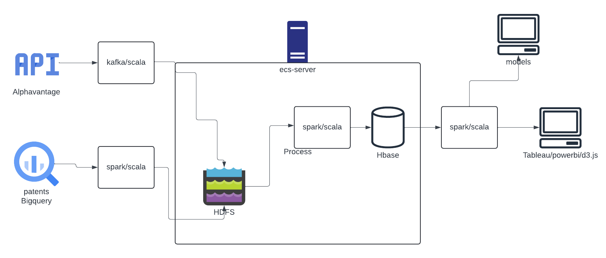
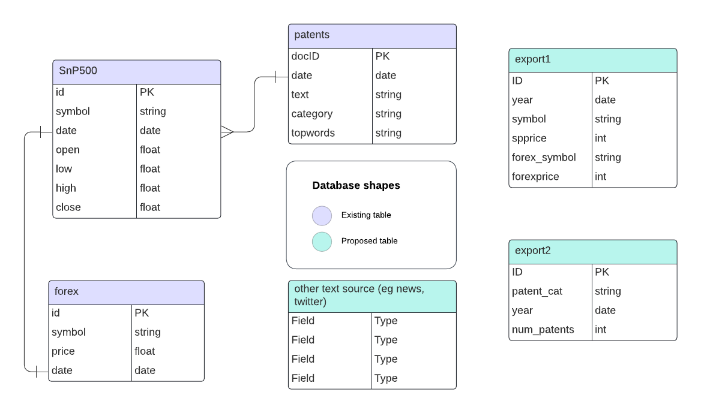
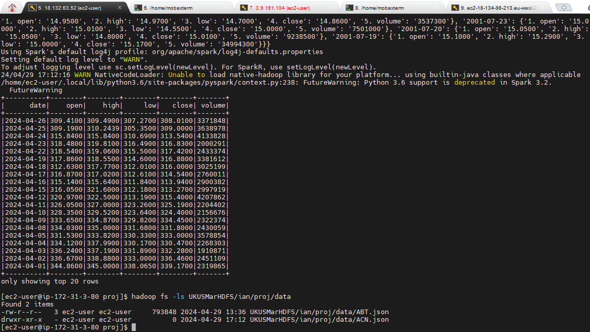
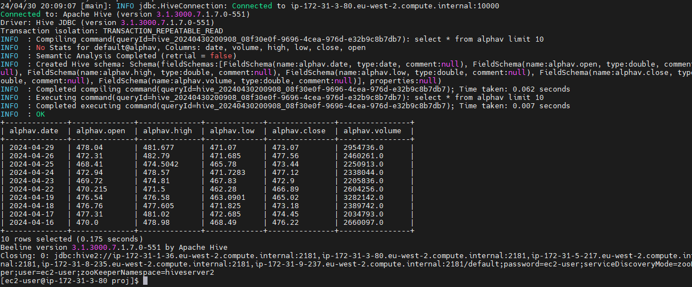
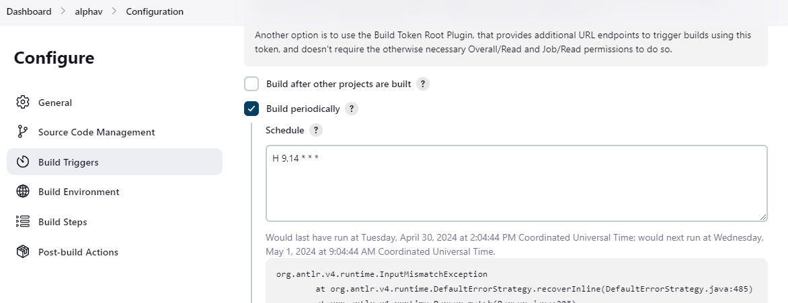
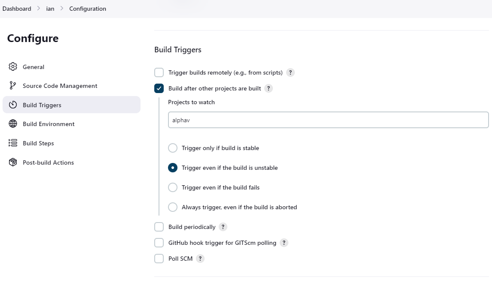
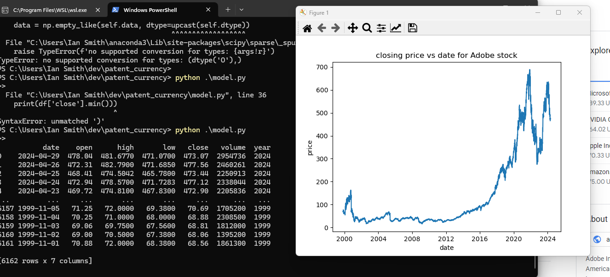
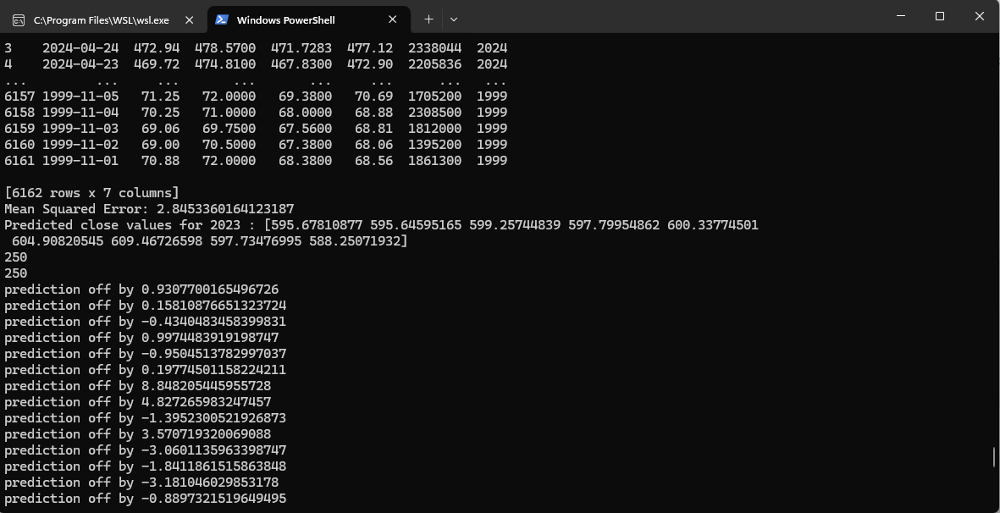

# S&P500 and Forex models

## data sources
Open exchange rates api
    1000 free requests per month
alphavantage api
    25 requests per day
google patents public data
## Flow 
### apis -> hdfs -> hive/hbase -> models

## beginning db model wip

## api to hdfs ingestion

## external hive table from hdfs 

## jenkins build triggers
### one to periodically query data from the api

### one following the api query build trigger

### Some basic feature enhancement and visualization

## Simple regression model results to predict 2023 prices
